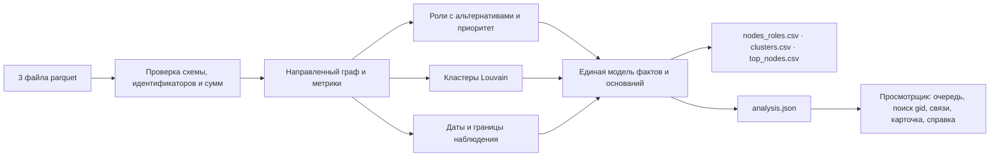

# Граф денег

Аналитический инструмент для специалиста финансового мониторинга банка. По выгрузке исходящих
переводов 81 известного клиента он восстанавливает сеть из 2 248 счетов, присваивает каждому
счёту объяснимую роль и отвечает на вопрос кейса: **кого проверять первым и почему**. Каждый
вывод — гипотеза для проверки аналитиком, а не утверждение о виновности.

## 1. Название проекта

«Граф денег» — решение кейса 02 «Финансы» хакатона HackAlem AI. Команда Masterart Netizens.

## 2. Краткое описание

Аналитику известен только нижний уровень цепочки — 81 клиент из оперативной информации. Кто
собирает деньги, через кого их прогоняют и где они оседают, приходится восстанавливать вручную.
Инструмент одной командой проходит путь от трёх исходных файлов parquet до трёх выгрузок
фиксированной схемы, а локальное рабочее место проверки показывает очередь приоритетов, кластеры,
направленные связи выбранного счёта, основания роли и её ближайшую альтернативу, датированные
цепочки и справку по счёту. Полный пересчёт на данных организаторов занимает меньше секунды.

## 3. Что реализовано

| Обязательное требование | Как выполнено | Состояние |
|---|---|---|
| 1. Воспроизводимый конвейер | `python -m backend --data data --out out`: parquet → проверка данных → три CSV за один запуск | Готово, проверено в чистой копии |
| 2. Роль и скор у каждого узла | Все 2 248 счетов: роль из словаря, `role_score`, `priority_score`, `cluster_id` и основание до 200 символов | Готово |
| 3. Объяснимые критерии ролей | Формальное правило с порогом для каждой роли; все пороги с единицами и обоснованием — в `backend/policy.py` | Готово |
| 4. Кластеризация | 92 кластера покрывают все счета: размер, число исходных клиентов, внутренний оборот, ключевые счета, гипотеза | Готово |
| 5. Топ-лист и визуализация | `top_nodes.csv` — 30 счетов с обоснованием; просмотрщик: поиск по точному `gid`, направление потоков, роли, кластеры | Готово, проверено в браузере |

Дополнительные пункты задания:

| Пункт | Что сделано | Состояние |
|---|---|---|
| Учёт обрыва на 4-м колене | 444 счёта глубины 4 без исходящих не получают роль «конечный получатель» | Готово |
| Временные паттерны | Цепочки от исходных клиентов в трёх режимах: только структура, строго более поздние даты, возможный порядок внутри дня; для датированной цепочки — пример из исходных транзакций | Готово |
| Возвратные потоки | Встречные переводы и циклы через выбранный счёт на карте и в списке | Готово |
| Карточка счёта | Роль, два-три факта с порогом правила, альтернатива, потоки, пробелы данных; справка в Markdown | Готово |
| Оценка полноты | Карточка называет пробелы наблюдения и данные, которые нужно запросить | Готово |
| Быстрый транзит, схождение в один день, маршруты, аномалии, устойчивость сети | Модуль дополнительных наблюдений | В интеграции |
| AI-ассистент аналитика | Вопрос словами → ответ по проверенным операциям чтения графа со ссылками на счета | В интеграции |

Полная карта «критерий → функция → проверка» — в [FEATURES.md](FEATURES.md).

## 4. Как работает

```
3 файла parquet → проверка данных → направленный граф и метрики → роли, приоритет, кластеры, даты
                → nodes_roles.csv · clusters.csv · top_nodes.csv · analysis.json → просмотрщик
```

**Проверка данных.** Сверяются схемы, уникальность счетов, признак исходного клиента и
согласованность транзакций с рёбрами: для каждой пары совпадают и сумма, и число операций
(стартовый код организаторов проверяет только наличие пар). Идентификаторы не округляются: все
2 248 `gid` больше предела точных целых чисел JavaScript, поэтому в JSON и браузере они хранятся
строками, а в CSV — десятичной записью `int64`.

**Роли.** Опора правила (`role_score`) равна 0,5 ровно на пороге и растёт до 1,0 к уровню
насыщения. Это эвристическая мера того, насколько уверенно выполнено правило, а не вероятность.
Основная роль выбирается сначала среди признаков веера (координатор, распределитель,
консолидатор), затем среди признаков баланса (транзит, конечный получатель). Остальные сработавшие
правила показываются как альтернативы — в карточке и в тексте основания.

| Роль | Правило (версия `finance-policy/2`) | Порог (насыщение) | Счетов |
|---|---|---|---:|
| `coordinator` — координатор | Прямые переводы с разными исходными клиентами: счёт на стыке их потоков | 3 (8) исходных клиента | 8 |
| `distributor` — распределитель | Переводы многим разным получателям при наблюдаемых исходящих | 10 (40) получателей | 63 |
| `consolidator` — консолидатор | Переводы от многих разных плательщиков | 7 (20) плательщиков | 12 |
| `transit` — транзит | Не исходный клиент; переводы другим счетам, отправленные не раньше поступления от иного плательщика, составляют 80–120% полученного | коридор 0,8–1,2; полная опора от 3 операций с каждой стороны | 37 |
| `terminal` — конечный получатель | Исходящие наблюдаются и не превышают 20% полученного; после поступления 90% суммы прошло не меньше 7 дней; не меньше 2 плательщиков или 500 000 ₸ | 7 (21) дней; 500 000 (2 000 000) ₸ | 150 |
| `peripheral` — периферийный | Ни одно правило не достигло 0,5. Если исходящие не собирались или окно наблюдения короткое, опора снижена вдвое; у счёта без переводов она равна 0 | — | 1 978 |

Числа плательщиков и получателей — нижние оценки: переводы извне выборки и суммы меньше
5 000 ₸ в данные не попали.

**Приоритет** считается отдельно от роли — как взвешенная сумма пяти раскрытых семейств
признаков: опора основной роли (30%), перцентиль оборота (25%), прямые связи с исходными
клиентами (20%), число исходных клиентов с цепочками возрастающих дат (15%), перцентиль числа
контрагентов (10%). Строка `why` в `top_nodes.csv` называет вклад каждого семейства.

**Кластеры** — метод Louvain с фиксированным зерном `20260923` на неориентированной проекции,
где вес пары — сумма переводов в обе стороны. Направления сохраняются в исходном графе, в
выгрузках и на карте. Гипотеза кластера описывает состав ролей и оборот и прямо оговаривает,
что это наблюдаемая структура переводов, а не вывод о связи владельцев.

**Сверка с подсказками организаторов.** В задании перечислены выраженные кандидаты на роли. Мы
воспроизводим каждое число на тех же данных и показываем, где наши правила строже:

| Подсказка организаторов | Воспроизведено | Как это отражено в ролях |
|---|---:|---|
| Узлы с входящими от 8–24 разных плательщиков | 17 | 9 консолидаторов и 8 распределителей: при веере на 10 и более получателей основной становится роль распределителя |
| Узлы с веерной рассылкой на 60–116 получателей | 8 | все 8 — распределители |
| 72 узла с коэффициентом пропуска 0,8–1,2 | 72 | транзитом остаются 37: правило исключает исходных клиентов и учитывает только деньги, ушедшие после поступления |
| 8 устойчивых сообществ Louvain с несколькими исходными клиентами | 8 | ровно 8 кластеров содержат больше одного исходного клиента |

**Учёт объявленных ограничений данных.**

| Ограничение | Решение |
|---|---|
| 444 счёта глубины 4 без исходящих — обрыв обхода | Роль «конечный получатель» им не присваивается; опора «сигналов нет» снижена; карточка просит данные об исходящих |
| Входящие извне выборки не видны, у исходных клиентов занижены | Транзит не присваивается исходным клиентам; доли считаются только по наблюдаемым суммам и названы наблюдаемыми |
| 19 исходных клиентов без рёбер, ещё 12 — только получатели | Все 2 248 счетов сохранены; у счёта без переводов роль не оценивается, и это сказано прямо |
| Порог 5 000 ₸ | Дробление ниже порога не заявляется |
| Даты без времени | Порядок внутри дня не выдумывается: для него есть отдельный режим «тот же день возможен» |
| Нет размеченных ролей | Точность не заявляется; оценивается обоснованность правил |

## 5. Технологии

- Анализ: Python 3.12+, pyarrow 25.0.0, NetworkX 3.6.1.
- Просмотрщик: React 19, TypeScript 5.9, Vite 7; сторонних графических библиотек и внешних шрифтов нет.
- Проверки: unittest для анализа, Vitest для интерфейса.
- Облачный кластер, GPU и платные сервисы не нужны. После установки зависимостей всё работает без сети.

Часть кода карты (камера, полноэкранный режим, форма связей), 17 значков и кнопка копирования
`gid` перенесены из собственного проекта автора, написанного до хакатона. Источник, ревизия и
список изменений — в [web/README.md](web/README.md#заимствованный-код). Остальной код написан на
хакатоне.

## 6. Архитектура



Выгрузки и интерфейс читают одни и те же вычисленные факты: просмотрщик ничего не пересчитывает
и не создаёт новых утверждений. Состав модулей и границы компонентов — в
[docs/architecture.md](docs/architecture.md).

## 7. Установка и запуск

Нужен Python 3.12 или новее. Положите три файла организаторов (`nodes.parquet`, `edges.parquet`,
`transactions.parquet`) в каталог `data/`.

**Выгрузки — одна команда анализа.** Этот путь не требует Node.js:

```bash
python3 -m venv .venv && . .venv/bin/activate
python -m pip install pyarrow==25.0.0 networkx==3.6.1
python -m backend --data data --out out
```

В `out/` появятся `nodes_roles.csv`, `clusters.csv`, `top_nodes.csv`, а также `analysis.json` для
просмотрщика и `run_receipt.json` с хешем входных файлов и временем расчёта.

**Просмотрщик.** Нужен Node.js 20.19+ или 22.12+:

```bash
cd web
npm ci
WORKBENCH_OUT=../out npm run dev
```

Откройте адрес, который напечатает Vite (по умолчанию http://127.0.0.1:5173). Первая установка
зависимостей обращается к реестру npm; дальше интерфейс работает без сети и не отправляет данные
наружу.

## 8. Как проверить

```bash
FINANCE_DATA=data FINANCE_DATA_DIR=data python -m unittest discover -s tests -v
cd web && npm ci && WORKBENCH_REAL=../out/analysis.json npm test
```

На версии `070b91a` в чистой копии прошли 70 проверок анализа и 39 проверок интерфейса, включая
прогон на данных организаторов. Без путей к данным проверки на официальных файлах явно
пропускаются, и это не считается подтверждением.

Каждая функция связана с тестом в [FEATURES.md](FEATURES.md). Три счёта, на которых удобно
проверить объяснения (жюри может назвать любые другие):

- `100000004015047100` — консолидатор: 9 разных плательщиков при пороге 7, не исходный клиент.
  У роли «конечный получатель» почти такая же опора, поэтому она показана как альтернатива.
- `100000003037476100` — счёт на 4-м колене: исходящие не собирались, поэтому роль «конечный
  получатель» не присвоена, а карточка называет недостающие данные.
- `100000000456947100` — исходный клиент без переводов в выгрузке: сохранён, роль не оценивается.

## 9. Данные и интеграции

Используются только обезличенные данные организаторов: 2 248 счетов, 3 119 агрегированных пар,
4 840 транзакций за 1–31 июля 2026 года, 81 исходный клиент, оборот 365 890 012,01 ₸. Данные не
хранятся в репозитории. Внешнее обогащение и персональные атрибуты не используются.

Выходы: три CSV по схеме задания, `analysis.json` (единая модель фактов для просмотрщика) и
`run_receipt.json`. Внешних интеграций в обязательном сценарии нет. AI-ассистент — необязательный
слой над теми же проверенными операциями чтения графа; без ключа API обязательный сценарий
работает полностью.

## 10. Ограничения

Выгрузка содержит только исходящие внутрибанковские переводы от исходных клиентов на глубину
четыре перехода с порогом 5 000 ₸. Полный баланс счёта, происхождение денег, личность клиента и
порядок операций внутри дня из этих данных не определяются. Цепочка с возрастающими датами не
доказывает движение тех же самых денег. Размеченных ролей нет, поэтому точность не заявляется:
роли и приоритеты — обоснованные гипотезы для проверки аналитиком. Пороги подобраны под структуру
этой выгрузки и при других данных требуют пересмотра.

### Что изменится при росте до 1 млн узлов

**Измерено сейчас** (Apple M4 Max, Python 3.14): сам анализ занимает 0,3–0,4 с, запуск целиком —
около 0,5–0,8 с, пиковая память — около 140 МБ; `analysis.json` весит 6,5 МБ, сборка интерфейса —
282 КБ скриптов. Эти числа относятся к 2 248 счетам и не переносятся на миллион линейно.

**Что придётся изменить** (проект, не проверенный результат). При пропорциях текущих данных миллион
счетов даёт порядка 1,4 млн пар и 2,2 млн транзакций.

- **Загрузка и метрики.** Словари Python заменяются колоночной обработкой (Arrow, DuckDB или
  Polars): степени, суммы и доли — группировки за один проход по рёбрам.
- **Кластеры.** Louvain в NetworkX выполняется в одном потоке; его заменяет Leiden (igraph) с
  фиксированным зерном — он быстрее и гарантирует связность сообществ.
- **Даты и цепочки.** Поиск от исходных клиентов остаётся ограниченным четырьмя переходами и
  монотонностью дат; транзакции индексируются по отправителю и дате.
- **Просмотрщик.** Один файл фактов перестаёт помещаться в браузер. Факты переносятся в локальную
  базу с индексом по `gid`, а интерфейс запрашивает только окрестность выбранного счёта, очередь
  приоритетов и верх кластера.
- **Обновления.** При ежедневных выгрузках пересчитываются только затронутые окрестности.

## 11. Ссылка на развёрнутую версию

Развёрнутой версии нет намеренно. Задание требует локальной работы с банковскими данными, поэтому
весь сценарий запускается на машине аналитика командами из раздела 7.
