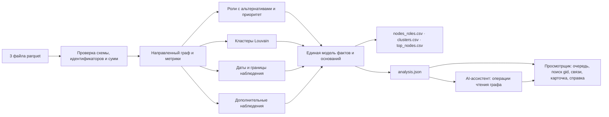

# Граф денег

Аналитический инструмент для специалиста финансового мониторинга банка. По выгрузке исходящих
переводов 81 известного клиента он восстанавливает сеть из 2 248 счетов, присваивает каждому
счёту объяснимую роль и отвечает на вопрос кейса: **кого проверять первым и почему**. Каждый
вывод — гипотеза для проверки аналитиком, а не утверждение о виновности.

**Навигация:** [1. Название](#1-название-проекта) · [2. Описание](#2-краткое-описание) ·
[3. Что реализовано](#3-что-реализовано) · [4. Как работает](#4-как-работает) ·
[5. Технологии](#5-технологии) · [6. Архитектура](#6-архитектура) ·
[7. Запуск](#7-установка-и-запуск) · [8. Как проверить](#8-как-проверить) ·
[9. Данные и интеграции](#9-данные-и-интеграции) · [10. Ограничения и масштаб](#10-ограничения) ·
[11. Развёрнутая версия](#11-ссылка-на-развёрнутую-версию)

**Документы:** [docs/code-tour.md](docs/code-tour.md) — экскурсия по коду простыми словами: путь
одного настоящего счёта через все модули, с формулами и ссылками на строки ·
[docs/validation.md](docs/validation.md) — обоснованность без эталона: подсказки организаторов,
ловушки данных, устойчивость к порогам и весам · [FEATURES.md](FEATURES.md) —
каждое требование задания со ссылками на строки кода и тесты · [docs/architecture.md](docs/architecture.md) — модули и границы достоверности ·
[docs/demo.md](docs/demo.md) — сценарий демо и ответы на вопросы · [web/README.md](web/README.md) —
устройство просмотрщика.

## Для жюри: проверка за пять минут

1. Положите три файла организаторов в `data/` и выполните `./run.sh`. Первый запуск ставит
   зависимости; затем анализ за секунды создаёт в `out/` три CSV, а просмотрщик запускается по
   адресу http://127.0.0.1:8765.
2. Откройте `out/nodes_roles.csv`, выберите любые три `gid` и найдите их в просмотрщике (клавиша `/`).
   Карточка объясняет роль через метрику и порог правила, показывает альтернативу и связи.
3. Сверьте объяснение с порогами в таблице раздела 4 и строками кода в [FEATURES.md](FEATURES.md).
   Как устроен весь код, за десять минут объясняет [экскурсия по коду](docs/code-tour.md).
4. Запустите проверки из раздела 8: 208 проверок анализа, сервера, ассистента, импорта и PDF и
   127 проверок интерфейса.

**Где смотреть по критериям оценки**

| Критерий (баллы) | Что подтверждает |
|---|---|
| Соответствие задаче и работоспособность (25) | Пять обязательных требований в разделе 3 и [FEATURES.md](FEATURES.md#обязательные-требования-раздел-7); одна команда `./run.sh` |
| Техническая реализация (25) | Модули и границы достоверности в [docs/architecture.md](docs/architecture.md); обоснованность правил, измеренная на данных, в [docs/validation.md](docs/validation.md); правила ролей со ссылками на код в [FEATURES.md](FEATURES.md#правила-ролей); AI-ассистент, который отвечает только проверенными операциями чтения графа |
| README и воспроизводимость (25) | Разделы 7–8; повторный запуск даёт побайтно те же выгрузки; каждая функция связана с тестом |
| Ценность и применимость (15) | Очередь проверки с обоснованием, справка по счёту, дополнительные наблюдения на данных организаторов (раздел 3) |
| Потенциал и оригинальность (10) | Датированные цепочки как проверяемое свидетельство, альтернатива роли рядом с выводом, раздел 10 о миллионе узлов |

## 1. Название проекта

«Граф денег» — решение кейса 02 «Финансы» хакатона HackAlem AI. Команда Masterart Netizens.

## 2. Краткое описание

Аналитику известен только нижний уровень цепочки — 81 клиент из оперативной информации. Кто
собирает деньги, через кого их прогоняют и где они оседают, приходится восстанавливать вручную.
Инструмент одной командой проходит путь от трёх исходных файлов parquet до трёх выгрузок
фиксированной схемы, а локальное рабочее место проверки показывает очередь приоритетов, кластеры,
направленные связи выбранного счёта, основания роли и её ближайшую альтернативу, датированные
цепочки и справку по счёту. Анализ на данных организаторов занимает секунды.

## 3. Что реализовано

| Обязательное требование | Как выполнено | Состояние |
|---|---|---|
| 1. Воспроизводимый конвейер | `./run.sh`: parquet → проверка данных → три CSV → просмотрщик; анализ не зависит от Node.js | Готово |
| 2. Роль и скор у каждого узла | Все 2 248 счетов: роль из словаря, `role_score`, `priority_score`, `cluster_id` и основание до 200 символов | Готово |
| 3. Объяснимые критерии ролей | Формальное правило с порогом для каждой роли; все пороги с единицами и обоснованием — в `backend/policy.py` | Готово |
| 4. Кластеризация | 92 кластера покрывают все счета: размер, число исходных клиентов, внутренний оборот, ключевые счета, гипотеза | Готово |
| 5. Топ-лист и визуализация | `top_nodes.csv` — 30 счетов с обоснованием за пределами списка исходных клиентов; просмотрщик: поиск по точному `gid`, направление потоков, роли, кластеры | Готово |

Все восемь дополнительных пунктов задания реализованы. Числа ниже получены на данных организаторов:

| Пункт | Что сделано и что найдено |
|---|---|
| Учёт обрыва на 4-м колене | 444 счёта глубины 4 без исходящих не получают роль «конечный получатель» |
| Временные паттерны | Цепочки от исходных клиентов в трёх режимах дат с примером из исходных транзакций. Быстрый транзит за 0–2 дня (без возврата тому же плательщику) — у 155 счетов; 66 случаев, когда 3–7 плательщиков сходятся на счёте в один день; всплески активности — у 41 счёта |
| Повторяющиеся маршруты и возвраты | 129 маршрутов A→B→C повторяются в разные дни; 387 коротких циклов, из них 227 можно пройти по переводам со строго возрастающими датами |
| Детекция аномалий | 105 пар с сериями из 3 и более переводов за 2 дня (у 36 — одинаковые суммы); 72 счёта с профилем, необычным для своей глубины |
| Устойчивость сети | Изъятие 10 счетов с наибольшим приоритетом дробит сеть на 117 фрагментов против 42 при случайном изъятии; сценарии для 1–20 счетов |
| AI-ассистент аналитика | Вопрос словами → ответ по проверенным операциям чтения графа со ссылками на счета. Вызов инструментов проверен на моделях OpenAI Astra, Sol и Luna; без ключа API работает локальный разбор по правилам |
| Карточка счёта | Роль, два-три факта с порогом правила, альтернатива, потоки, пробелы данных; кнопки «Сохранить» и «Справка PDF»; вкладка «Сохранённые» собирает счета для проверки и выгружает PDF-справку по отмеченным |
| Оценка полноты | Для каждого наблюдения указано, каких данных не хватает; счета сгруппированы по трём видам запросов |

Кроме пунктов задания: **загрузка своих данных прямо в интерфейсе** — окно «О данных» или вкладка
«Данные» принимают три файла той же схемы в формате parquet или CSV, проверяют их тем же загрузчиком и
строят новый анализ без командной строки. В интеграции и пока не входят в эту версию: история диалога
ассистента и выбор периода дат в интерфейсе.

## 4. Как работает

```
3 файла parquet → проверка данных → направленный граф и метрики → роли, приоритет, кластеры, даты
                → nodes_roles.csv · clusters.csv · top_nodes.csv · analysis.json → просмотрщик
```

**Проверка данных.** Сверяются схемы, уникальность счетов, признак исходного клиента и
согласованность транзакций с рёбрами: для каждой пары совпадают и сумма, и число операций
(стартовый код организаторов проверяет только наличие пар). Идентификаторы не округляются: все
2 248 `gid` больше предела точных целых чисел JavaScript, поэтому в JSON и браузере они хранятся
строками, а в CSV — десятичной записью `int64`.

**Роли.** Опора правила (`role_score`) равна 0,5 ровно на пороге и растёт до 1,0 к уровню
насыщения. Это эвристическая мера того, насколько уверенно выполнено правило, а не вероятность.
Основная роль выбирается сначала среди признаков веера (координатор, распределитель,
консолидатор), затем среди признаков баланса (транзит, конечный получатель). Остальные сработавшие
правила показываются как альтернативы — в карточке и в тексте основания. Строки кода каждого
правила и его тесты — в [FEATURES.md](FEATURES.md#правила-ролей).

| Роль | Правило (версия `finance-policy/2`) | Порог (насыщение) | Счетов |
|---|---|---|---:|
| `coordinator` — координатор | Прямые переводы с разными исходными клиентами: счёт на стыке их потоков | 3 (8) исходных клиента | 8 |
| `distributor` — распределитель | Переводы многим разным получателям при наблюдаемых исходящих | 10 (40) получателей | 63 |
| `consolidator` — консолидатор | Переводы от многих разных плательщиков | 7 (20) плательщиков | 12 |
| `transit` — транзит | Не исходный клиент; переводы другим счетам, отправленные не раньше поступления от иного плательщика, составляют 80–120% полученного | коридор 0,8–1,2; полная опора от 3 операций с каждой стороны | 37 |
| `terminal` — конечный получатель | Исходящие наблюдаются и составляют не больше 20% наблюдаемых входящих; с дня, когда набралось 90% входящей суммы, прошло не меньше 7 дней; не меньше 2 плательщиков или 500 000 ₸ | 7 (21) дней; 500 000 (2 000 000) ₸ | 150 |
| `peripheral` — периферийный | Ни одно правило не достигло 0,5. Если исходящие не собирались или окно наблюдения короткое, опора снижена вдвое; у счёта без переводов она равна 0 | — | 1 978 |

Числа плательщиков и получателей — нижние оценки: переводы извне выборки и суммы меньше
5 000 ₸ в данные не попали.

**Приоритет** считается отдельно от роли — как взвешенная сумма пяти раскрытых семейств
признаков: опора основной роли (30%), перцентиль оборота (25%), прямые связи с исходными
клиентами (20%), число исходных клиентов с цепочками возрастающих дат (15%), перцентиль числа
контрагентов (10%). Строка `why` в `top_nodes.csv` называет вклад каждого семейства.

**Очередь проверки не включает 81 исходного клиента.** Их банк уже знает; задача кейса — сместить
фокус «с 81 курьера на реальные точки консолидации». Поэтому `top_nodes.csv` — 30 счетов с наибольшим
приоритетом среди остальных, а приоритет самих исходных клиентов виден в `nodes_roles.csv`. Первые в
очереди — два консолидатора (9 и 8 разных плательщиков) и координатор.

**Кластеры** — метод Louvain с фиксированным зерном `20260923` на неориентированной проекции,
где вес пары — сумма переводов в обе стороны. Направления сохраняются в исходном графе, в
выгрузках и на карте. Гипотеза кластера описывает состав ролей и оборот и прямо оговаривает,
что это наблюдаемая структура переводов, а не вывод о связи владельцев.

**Сверка с подсказками организаторов.** В задании перечислены выраженные кандидаты на роли. Мы
воспроизводим каждое число на тех же данных и показываем, где наши правила строже:

| Подсказка организаторов | Воспроизведено | Как это отражено в ролях |
|---|---:|---|
| Узлы с входящими от 8–24 разных плательщиков | 17 | 9 консолидаторов и 8 распределителей: при веере на 10 и более получателей основной становится роль распределителя |
| Узлы с веерной рассылкой на 60–116 получателей | 8 | все 8 — распределители |
| 72 узла с коэффициентом пропуска 0,8–1,2 | 72 | транзитом остаются 37: правило исключает исходных клиентов и учитывает только деньги, ушедшие после поступления |
| 8 устойчивых сообществ Louvain с несколькими исходными клиентами | 8 | ровно 8 кластеров содержат больше одного исходного клиента |

**Устойчивость.** Мы сдвинули каждый порог на шаг вниз и вверх и заново запустили анализ: число
счетов с ролью меняется, а из 30 счетов очереди остаются 27–30. При других весах приоритета остаются
21–28 из 30, и лишь порядок в самом верху зависит от весов. С 30 крупнейшими по обороту счетами очередь
совпадает только в 8 случаях. Таблицы и команда для повторения — в
[docs/validation.md](docs/validation.md).

**Учёт объявленных ограничений данных.**

| Ограничение | Решение |
|---|---|
| 444 счёта глубины 4 без исходящих — обрыв обхода | Роль «конечный получатель» им не присваивается; опора «сигналов нет» снижена; карточка просит данные об исходящих |
| Входящие извне выборки не видны, у исходных клиентов занижены | Транзит не присваивается исходным клиентам; доли считаются только по наблюдаемым суммам и названы наблюдаемыми |
| 19 исходных клиентов без рёбер, ещё 12 — только получатели | Все 2 248 счетов сохранены; у счёта без переводов роль не оценивается, и это сказано прямо |
| Порог 5 000 ₸ | Дробление ниже порога не заявляется; серии переводов выше порога показаны отдельно |
| Даты без времени | Порядок внутри дня не выдумывается: для него есть отдельный режим «тот же день возможен» |
| Нет размеченных ролей | Точность не заявляется; оценивается обоснованность правил |

## 5. Технологии

- Анализ: Python 3.12+, pyarrow 25.0.0, NetworkX 3.6.1.
- Просмотрщик: React 19, TypeScript 5.9, Vite 7; сторонних графических библиотек и внешних шрифтов нет.
- AI-ассистент: OpenAI Responses API со строгими схемами инструментов; модель вызывает только
  операции чтения графа, а текст ответа собирается из их результатов.
- PDF-справки: ReportLab 4.4.9; шрифты Noto Sans распространяются по
  [SIL Open Font License 1.1](reports/fonts/OFL.txt).
- Проверки: unittest для анализа, сервера, ассистента и PDF; Vitest для интерфейса.
- Облачный кластер, GPU и платные сервисы не нужны. Без ключа API всё, кроме разбора вопроса
  языковой моделью, работает без сети.

Часть кода карты (камера, полноэкранный режим, форма связей), 17 значков и кнопка копирования
`gid` перенесены из собственного проекта автора, написанного до хакатона. Источник, ревизия и
список изменений — в [web/README.md](web/README.md#заимствованный-код). Остальной код написан на
хакатоне.

## 6. Архитектура



Выгрузки, просмотрщик и ассистент читают одни и те же вычисленные факты. Роли, приоритеты и
кластеры считает только конвейер анализа; просмотрщик выводит из общей модели представление —
окрестность счёта, факты роли, справку, — а ассистент не может создать новый факт. Состав модулей и границы компонентов — в
[docs/architecture.md](docs/architecture.md).

## 7. Установка и запуск

Нужен Python 3.12 или новее; для просмотрщика дополнительно Node.js 20.19+ или 22.12+ и npm.
Положите три файла организаторов (`nodes.parquet`, `edges.parquet`, `transactions.parquet`) в
каталог `data/` и выполните одну команду:

```bash
./run.sh
```

Скрипт создаёт среду Python и ставит зависимости, **сначала выполняет анализ** и записывает
выгрузки в `out/`, затем собирает интерфейс и запускает просмотрщик по адресу
http://127.0.0.1:8765. Без Node.js анализ всё равно выполняется и три CSV появляются в `out/`;
скрипт объясняет, чего не хватает для просмотрщика. Первая установка зависимостей требует сети.

| Параметр | Назначение |
|---|---|
| `--data каталог` | Каталог с тремя файлами parquet (по умолчанию `data/`) |
| `--out каталог` | Каталог результатов (по умолчанию `out/`) |
| `--no-serve` | Только анализ и сборка, без сервера |
| `--port порт` | Порт просмотрщика (по умолчанию 8765) |

В `out/` появятся `nodes_roles.csv`, `clusters.csv`, `top_nodes.csv`, `analysis.json` для
просмотрщика, `run_receipt.json` с хешем входных файлов и временем расчёта, `runtime-receipt.json`
со временем установки, анализа и сборки и `last_attempt.json` с итогом последней попытки. Если
запуск завершится ошибкой, прежние выгрузки сохранятся.

Только анализ, без скрипта: `python -m backend --data data --out out` после
`pip install -r requirements.txt`.

**AI-ассистент (необязательно).** Задайте переменную окружения `OPENAI_API_KEY` перед `./run.sh`;
модель выбирается переменной `OPENAI_MODEL`. Без ключа ассистент отвечает локальным разбором по
правилам и прямо сообщает об этом.

**PDF-справка.** Из командной строки после анализа:

```bash
.venv/bin/python -m reports --analysis out/analysis.json --gid 100000004015047100
```

Флаг `--gid` можно повторить, чтобы собрать справку по нескольким счетам; `--mode` выбирает режим
путей. В просмотрщике та же справка открывается кнопкой «Справка PDF» в карточке счёта.

**Свои данные через интерфейс.** Откройте окно «О данных» (сводка справа вверху) или вкладку
«Данные» и выберите три файла: `nodes`, `edges`, `transactions` в формате `.parquet` или `.csv` с
именами столбцов в первой строке. Сервер проверяет их теми же правилами, что и командная строка,
строит новый анализ и заменяет выгрузки только после полного успеха; при ошибке прежние результаты
сохраняются, а причина показывается по-русски. CSV-файлы организаторов дают тот же отпечаток
содержимого и побайтно те же выгрузки, что и parquet.

## 8. Как проверить

```bash
./run.sh --no-serve
.venv/bin/python -m pip install pypdf==6.19.0      # только для проверки текста PDF-справок
FINANCE_DATA=data FINANCE_DATA_DIR=data FINANCE_ANALYSIS=out/analysis.json \
  ASSISTANT_ANALYSIS_PATH=out/analysis.json WORKBENCH_VERIFY_BOOTSTRAP=1 \
  .venv/bin/python -m unittest discover -s tests -v
cd web && WORKBENCH_REAL=../out/analysis.json npm test
for part in assistant shortlist import insights; do npx vitest run --config src/features/$part/vitest.config.ts; done
```

В чистой копии этой версии прошли все 208 проверок анализа, сервера, ассистента, импорта и
PDF-справок и 127 проверок интерфейса (просмотрщик — 48, ассистент — 27, сохранённые счета — 33,
импорт — 10, наблюдения — 9; ещё одна проверка наблюдений пропускается без настоящего файла), включая прогон на данных организаторов.
Переменные окружения включают проверки на официальных данных и полную установку из копии
исходников; без них эти проверки явно пропускаются, и это не считается подтверждением.

Каждое требование задания связано со строками кода и тестом в [FEATURES.md](FEATURES.md). Три
счёта, на которых удобно проверить объяснения (жюри может назвать любые другие):

- `100000004015047100` — первый в очереди проверки, консолидатор: 9 разных плательщиков при пороге 7.
  У роли «конечный получатель» почти такая же опора, поэтому она показана как альтернатива.
- `100000003037476100` — счёт на 4-м колене: исходящие не собирались, поэтому роль «конечный
  получатель» не присвоена, а карточка называет недостающие данные.
- `100000000456947100` — исходный клиент без переводов в выгрузке: сохранён, роль не оценивается.

## 9. Данные и интеграции

Используются только обезличенные данные организаторов: 2 248 счетов, 3 119 агрегированных пар,
4 840 транзакций за 1–31 июля 2026 года, 81 исходный клиент, оборот 365 890 012,01 ₸. Данные не
хранятся в репозитории. Внешнее обогащение и персональные атрибуты не используются.

Выходы: три CSV по схеме задания, `analysis.json` (единая модель фактов, включая дополнительные
наблюдения) и квитанции запуска. Выгрузки последнего проверенного запуска на данных организаторов
лежат в [results/](results/): `./run.sh` создаёт в `out/` побайтно такие же файлы. Единственная внешняя интеграция — необязательный OpenAI API для
ассистента. Если ключ задан, модель получает вопрос и факты графа, выбранные проверенными
операциями чтения; без ключа данные не покидают машину. Сервер просмотрщика слушает только
127.0.0.1 и отдаёт лишь интерфейс, четыре файла результатов и запросы к ассистенту, PDF-справкам
и импорту.

## 10. Ограничения

Выгрузка содержит только исходящие внутрибанковские переводы от исходных клиентов на глубину
четыре перехода с порогом 5 000 ₸. Полный баланс счёта, происхождение денег, личность клиента и
порядок операций внутри дня из этих данных не определяются. Цепочка с возрастающими датами не
доказывает движение тех же самых денег. Размеченных ролей нет, поэтому точность не заявляется:
роли и приоритеты — обоснованные гипотезы для проверки аналитиком. Пороги подобраны под структуру
этой выгрузки и при других данных требуют пересмотра.

### Что изменится при росте до 1 млн узлов

**Измерено сейчас** (Apple M4 Max, Python 3.14): полный запуск `./run.sh --no-serve` из чистой
копии — около 13 с, из них анализ — около 5 с при первом запуске в новой среде и меньше секунды при
повторном; пиковая память анализа — около 140 МБ; `analysis.json` весит 6,7 МБ. Эти числа относятся
к 2 248 счетам и не переносятся на миллион линейно.

**Что придётся изменить** (проект, не проверенный результат). При пропорциях текущих данных миллион
счетов даёт порядка 1,4 млн пар и 2,2 млн транзакций.

- **Загрузка и метрики.** Словари Python заменяются колоночной обработкой (Arrow, DuckDB или
  Polars): степени, суммы и доли — группировки за один проход по рёбрам.
- **Кластеры.** Louvain в NetworkX выполняется в одном потоке. Кандидат на замену — Leiden
  (igraph) с фиксированным зерном: он гарантирует связность сообществ, а выигрыш во времени и
  устойчивость кластеров нужно измерить на тех же данных до перехода.
- **Даты и цепочки.** Сейчас поиск от исходных клиентов проходит по всем наблюдаемым переходам;
  глубина 4 — это граница сбора выгрузки, а не ограничение алгоритма. На большом графе поиск
  отсекает ветви по монотонности дат, а транзакции индексируются по отправителю и дате.
- **Циклы и маршруты.** Перечисление циклов уже ограничено длиной 4 и пределом числа циклов; на
  большом графе оно выполняется по компонентам параллельно.
- **Просмотрщик и ассистент.** Один файл фактов перестаёт помещаться в браузер. Факты переносятся
  в локальную базу с индексом по `gid`, а интерфейс и ассистент запрашивают только окрестность
  выбранного счёта, очередь приоритетов и верх кластера.
- **Обновления.** При ежедневных выгрузках пересчитываются только затронутые окрестности.

## 11. Ссылка на развёрнутую версию

Развёрнутой версии нет намеренно. Задание требует локальной работы с банковскими данными, поэтому
весь сценарий запускается на машине аналитика командой `./run.sh`.
