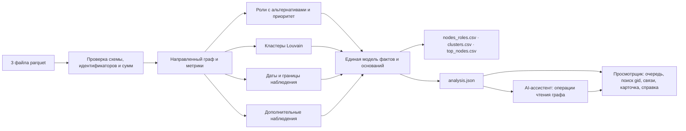

# Схема решения

Данные → метрики → роли → интерфейс. Выгрузки, просмотрщик и ассистент получают факты из одной
модели, поэтому число в карточке счёта и в ответе ассистента совпадает с числом в CSV. Строки кода
каждой функции и её тесты — в [FEATURES.md](../FEATURES.md).

## Запуск

[`run.sh`](../run.sh) сначала выполняет анализ и проверяет, что три CSV созданы, и только затем
собирает интерфейс и запускает [`serve.py`](../serve.py). Если Node.js нет, выгрузки уже готовы, а
скрипт объясняет, что нужно для просмотрщика.

## Модули анализа ([`backend/`](../backend))

| Модуль | Ответственность |
|---|---|
| [`io.py`](../backend/io.py) | Чтение parquet и проверка входа: схемы, уникальность, точные идентификаторы, совпадение сумм и числа транзакций по каждой паре |
| [`metrics.py`](../backend/metrics.py) | Метрики направленного графа: плательщики, получатели, суммы, доли, окно наблюдения, границы выборки |
| [`policy.py`](../backend/policy.py) | Единственный источник порогов: значение, единица, обоснование; тексты правил и ограничений |
| [`roles.py`](../backend/roles.py) | Правила шести ролей, опора каждого правила, выбор основной роли и альтернатив, текст основания и следующий запрос данных |
| [`priority.py`](../backend/priority.py) | Приоритет проверки из пяти раскрытых семейств признаков и текст `why` |
| [`clusters.py`](../backend/clusters.py) | Louvain с фиксированным зерном, показатели и гипотеза кластера |
| [`temporal.py`](../backend/temporal.py) | Цепочки от исходных клиентов с проверкой дат и примеры из исходных транзакций |
| [`insights.py`](../backend/insights.py), [`insight_policy.py`](../backend/insight_policy.py) | Быстрый транзит, схождение в один день, всплески, маршруты, циклы, серии переводов, профиль по глубине, сценарии удаления, запросы данных; параметры с единицами |
| [`analysis.py`](../backend/analysis.py) | Сборка единой модели фактов (`analysis.json`) |
| [`exports.py`](../backend/exports.py), [`fmt.py`](../backend/fmt.py) | Три CSV фиксированной схемы, атомарная запись и квитанции; русское форматирование чисел и сумм |
| [`__main__.py`](../backend/__main__.py) | Командная строка `python -m backend --data … --out …` |

## AI-ассистент ([`assistant/`](../assistant))

| Модуль | Ответственность |
|---|---|
| [`queries.py`](../assistant/queries.py) | Операции чтения графа со строгими схемами: счёт, соседи, очередь, кластер, схождение, даты, пробелы |
| [`service.py`](../assistant/service.py) | Ответ на вопрос: локальный разбор по правилам или вызов модели с этими операциями как инструментами |
| [`openai.py`](../assistant/openai.py), [`config.py`](../assistant/config.py) | Запрос к OpenAI API по фиксированному адресу с тайм-аутом; ключ только из окружения |
| [`render.py`](../assistant/render.py) | Текст ответа из результатов операций со ссылками на счета |

## PDF-справки ([`reports/`](../reports))

| Модуль | Ответственность |
|---|---|
| [`facts.py`](../reports/facts.py) | Проверка запроса (точные `gid`, режим путей) и выбор фактов счёта из `analysis.json` |
| [`pdf.py`](../reports/pdf.py) | Вёрстка справки: роль и альтернатива, потоки, датированный путь, границы наблюдения; шрифты Noto Sans ([лицензия](../reports/fonts/OFL.txt)) |
| [`__main__.py`](../reports/__main__.py) | Командная строка `python -m reports --analysis … --gid …`; тот же отчёт отдаёт `POST /api/report` сервера |

## Просмотрщик ([`web/src/`](../web/src))

| Каталог | Ответственность |
|---|---|
| [`data/`](../web/src/data) | Проверка `analysis.json` при загрузке, точный поиск `gid`, окрестность, факты роли, справка |
| [`map/`](../web/src/map) | Раскладка окрестности и кластера, камера и полноэкранный режим |
| [`ui/`](../web/src/ui) | Очередь, поиск, карта и список, основания, кластер, состояния загрузки |
| [`features/assistant/`](../web/src/features/assistant) | Панель ассистента: вопрос, ответ со ссылками на счета, отмена запроса |
| [`app/`](../web/src/app) | Корень приложения, загрузка файла, состояние в адресе, история «Назад» и «Вперёд» |
| [`styles/`](../web/src/styles) | Токены, базовые стили, компоненты, виды, адаптивный слой |

## Границы достоверности

- Загрузчик сохраняет все 2 248 счетов, включая исходных клиентов без рёбер. Несовпадение сумм или
  числа транзакций останавливает запуск, а прежние выгрузки сохраняются.
- Каждое правило роли — метрика, порог из `policy.py` и понятное объяснение. Приоритет отделён от
  роли: сильная роль сама по себе не делает счёт срочным.
- Отсутствие наблюдаемых исходящих на границе выборки не считается доказательством того, что
  деньги остались на счёте.
- Кластер — гипотеза о наблюдаемой структуре переводов, а не вывод о связи владельцев.
- Датированная цепочка показывает, что порядок дат допускает движение денег, но не доказывает, что
  двигались те же самые деньги. Порядок внутри одного дня неизвестен и показывается отдельно.
- Идентификаторы в JSON и браузере — строки; в CSV — десятичная запись `int64`. Ни одна операция
  интерфейса или ассистента не превращает `gid` в число.
- Просмотрщик не пересчитывает роли, приоритеты и кластеры: он выводит из общей модели только
  представление — окрестность, факты роли, справку. Ассистент может только вызывать операции
  чтения графа; каждая ссылка в ответе проверяется по модели фактов, а вопросы о личности, вине и
  происхождении денег отклоняются.
- Сервер слушает только 127.0.0.1, проверяет заголовки `Host` и `Origin` и отдаёт лишь интерфейс,
  четыре файла результатов и запросы к ассистенту.

## Производительность

Полный запуск `./run.sh --no-serve` из чистой копии занимает около 13 с (Apple M4 Max), из них
анализ — около 5 с при первом запуске в новой среде и меньше секунды при повторном; пиковая
память анализа — около 140 МБ. Предел задания — пять минут. Что изменится при миллионе счетов,
описано в README, раздел 10.
