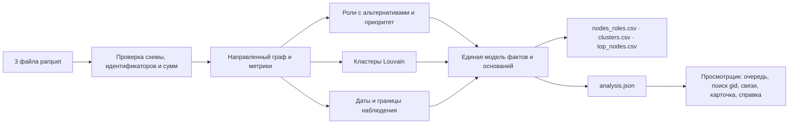

# Схема решения

Данные → метрики → роли → интерфейс. Выгрузки и просмотрщик получают факты из одной модели,
поэтому число в карточке счёта всегда совпадает с числом в CSV.

## Модули анализа (`backend/`)

| Модуль | Ответственность |
|---|---|
| `io.py` | Чтение parquet и проверка входа: схемы, уникальность, точные идентификаторы, совпадение сумм и числа транзакций по каждой паре |
| `metrics.py` | Метрики направленного графа: плательщики, получатели, суммы, доли, границы наблюдения |
| `policy.py` | Единственный источник порогов: значение, единица, обоснование; тексты правил и ограничений |
| `roles.py` | Правила шести ролей, опора каждого правила, выбор основной роли и альтернатив |
| `priority.py` | Приоритет проверки из пяти раскрытых семейств признаков и текст `why` |
| `clusters.py` | Louvain с фиксированным зерном, показатели и гипотеза кластера |
| `temporal.py` | Цепочки от исходных клиентов с проверкой дат и примеры из исходных транзакций |
| `analysis.py` | Сборка единой модели фактов (`analysis.json`) |
| `exports.py`, `fmt.py` | Три CSV фиксированной схемы и русское форматирование чисел и сумм |
| `__main__.py` | Командная строка `python -m backend --data … --out …` и квитанция запуска |

## Модули просмотрщика (`web/src/`)

| Каталог | Ответственность |
|---|---|
| `data/` | Проверка `analysis.json` при загрузке, точный поиск `gid`, окрестность, факты роли, справка |
| `map/` | Раскладка окрестности и кластера, камера и полноэкранный режим |
| `ui/` | Очередь, поиск, карта и список, основания, кластер, состояния загрузки |
| `app/` | Корень приложения, загрузка файла, состояние в адресе, история «Назад» и «Вперёд» |
| `styles/` | Токены, базовые стили, компоненты, виды, адаптивный слой |

## Границы достоверности

- Загрузчик сохраняет все 2 248 счетов, включая исходных клиентов без рёбер. Несовпадение сумм или
  числа транзакций останавливает запуск, а прежние выгрузки сохраняются.
- Каждое правило роли — метрика, порог из `policy.py` и понятное объяснение. Приоритет отделён от
  роли: сильная роль не делает счёт срочным сама по себе.
- Отсутствие наблюдаемых исходящих на границе выборки не считается доказательством того, что
  деньги остались на счёте.
- Кластер — гипотеза о наблюдаемой структуре переводов, а не вывод о связи владельцев.
- Датированная цепочка показывает, что порядок дат допускает движение денег, но не доказывает, что
  двигались те же самые деньги. Порядок внутри одного дня неизвестен и показывается отдельно.
- Идентификаторы в JSON и браузере — строки; в CSV — десятичная запись `int64`. Ни одна операция
  интерфейса не превращает `gid` в число.
- Просмотрщик не пересчитывает и не дополняет факты; необязательный AI-ассистент может только
  вызывать те же операции чтения графа и ссылаться на счета.

## Производительность

На данных организаторов анализ занимает 0,3–0,4 с, пиковая память — около 140 МБ (Apple M4 Max,
Python 3.14). Предел задания — пять минут. Что изменится при миллионе счетов, описано в README,
раздел 10.
