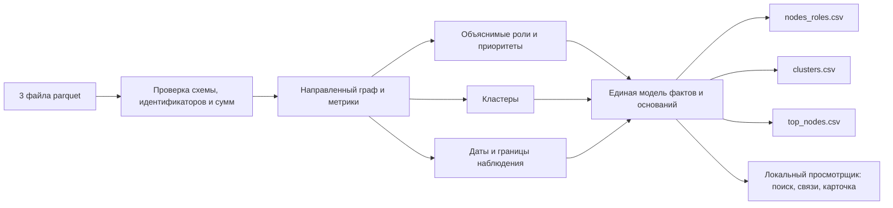

# Схема решения

**Состояние реализации:** загрузка, проверки, метрики, роли, кластеры, даты и выгрузки реализованы.
Локальный просмотрщик и AI-ассистент находятся в разработке. Схема показывает весь целевой путь.

## Границы компонентов

- Загрузчик сохраняет все узлы, включая исходных клиентов без рёбер. Суммы и число транзакций
  проверяются против агрегированных рёбер.
- Аналитика использует направление переводов. Для каждого правила предусмотрены метрика,
  порог и понятное объяснение. Приоритет проверки отделён от предполагаемой роли.
- Кластеры охватывают каждый узел. Их описание является гипотезой о наблюдаемой структуре.
- Неполнота данных отображается рядом с выводом. Нулевой наблюдаемый исходящий поток не становится
  доказательством конечного получателя.
- Интерфейс и выгрузки читают одни и те же вычисленные факты. Идентификаторы в браузере и JSON
  передаются строками, а в CSV сохраняют требуемую десятичную запись `int64`.
- Возможный AI-ассистент обращается к проверяемым операциям чтения графа. Без него обязательный
  локальный сценарий должен оставаться доступным.

## Проверка будущего результата

Сначала проверяется полный путь от исходных файлов до трёх выгрузок. Затем — совпадение
фактов в карточке с этими выгрузками и поиск произвольного счёта. Время пересчёта измеряется
отдельно; допустимый предел задания — пять минут.
