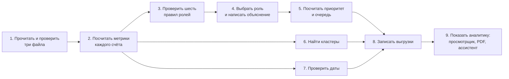

# Экскурсия по коду

Этот документ объясняет, как устроен проект, простыми словами — так, чтобы его понял школьник.
Мы проследим путь одного настоящего счёта, `100000004015047100`, от сырых файлов до вывода «проверить первым».
На каждом шаге сказано, что происходит, что получилось у этого счёта, где это в коде (ссылки ведут
на нужные строки) и какой тест это проверяет. Полная карта требований задания — в
[FEATURES.md](../FEATURES.md).

## Картина целиком

Представьте город, где деньги переходят от человека к человеку. По оперативной информации банк знает
81 клиента — нижний уровень цепочки, «курьеров». Банк выгрузил их исходящие переводы за июль внутри
банка (от 5 000 ₸), потом переводы тех, кому они платили, и так четыре шага подряд. Получилась сеть из
2 248 счетов.
Программа отвечает на вопрос: **кто в этой сети собирает деньги, кто их передаёт, у кого они
остаются — и кого проверять первым**.



| Шаг | Где в коде | Одной фразой |
|---|---|---|
| 1 | [`backend/io.py`](../backend/io.py) | Читает три файла и проверяет, что всё сходится до тиына |
| 2 | [`backend/metrics.py`](../backend/metrics.py) | Считает для каждого счёта плательщиков, получателей, суммы и доли |
| 3–4 | [`backend/roles.py`](../backend/roles.py), [`backend/policy.py`](../backend/policy.py) | Проверяет правила ролей по порогам из одного файла и пишет объяснение |
| 5 | [`backend/priority.py`](../backend/priority.py) | Складывает пять признаков в приоритет и строит очередь |
| 6 | [`backend/clusters.py`](../backend/clusters.py) | Делит сеть на группы связанных счетов |
| 7 | [`backend/temporal.py`](../backend/temporal.py) | Проверяет, могли ли деньги пройти цепочку по датам |
| 8 | [`backend/analysis.py`](../backend/analysis.py), [`backend/exports.py`](../backend/exports.py) | Собирает все факты в один файл и пишет три CSV |
| 9 | [`web/src`](../web/src), [`reports`](../reports), [`assistant`](../assistant) | Показывает всё человеку: карта, карточка, PDF, ответы на вопросы |

## Словарь

| Слово | Что значит |
|---|---|
| Счёт, `gid` | Клиент банка под номером из 18 цифр; имён в данных нет |
| Перевод | Одна отправка денег с датой и суммой |
| Ребро | Все переводы от одного счёта другому за месяц, сложенные вместе |
| Исходный клиент | Один из 81 известного счёта, с которых начался сбор данных |
| Колено (глубина) | Сколько переводов отделяет счёт от ближайшего исходного клиента; сбор остановился на 4 |
| Роль | Гипотеза о том, как счёт обращается с деньгами: собирает, передаёт, раздаёт, оставляет себе |
| Порог | Число, с которого правило срабатывает, например «7 разных плательщиков» |
| Опора роли | Насколько уверенно выполнено правило: 0,5 ровно на пороге, 1,0 — с большим запасом. Это не вероятность вины |
| Приоритет | Место в очереди проверки: взвешенная сумма пяти признаков |
| Кластер | Группа счетов, которые переводят деньги в основном друг другу |

## Шаг 1. Прочитать и проверить данные

**Что происходит.** Программа читает три файла: список счетов, рёбра и отдельные переводы. Потом
проверяет, что всё сходится: для каждой пары счетов сумма отдельных переводов равна сумме ребра, а
их число — числу в ребре. Суммы переводятся в тиыны — целые числа, поэтому при сложении не
накапливаются ошибки округления. Если что-то не сходится, программа останавливается и объясняет
причину.

**У нашего счёта.** На него пришло 18 переводов от 9 разных плательщиков, всего 919 104 ₸. Первые
поступления — 2 июля 2026 года: 9 000 ₸ от исходного клиента `100000001616816100` и 10 000 ₸ от
другого плательщика; последнее — 23 июля.

- **Где в коде:** [`load_dataset`](../backend/io.py#L227-L237) в `backend/io.py`, [`validate_rows`](../backend/io.py#L142-L224) в `backend/io.py`, [`to_tiyn`](../backend/io.py#L56-L76) в `backend/io.py`.
- **Тест:** [`test_core_validation_sum_and_count_mismatch`](../tests/test_core.py#L428-L434).

## Шаг 2. Посчитать метрики

**Что происходит.** Для каждого счёта программа считает: сколько у него разных плательщиков и
получателей, сколько денег пришло и ушло, какую долю он передал дальше и сколько дней прошло с того
дня, когда набралось 90% входящей суммы, до конца периода.

**У нашего счёта.** 9 плательщиков, 1 получатель. Пришло 919 104 ₸, ушло 69 195 ₸ — это 8%
наблюдаемых входящих. 90% суммы набралось за 10 дней до конца июля.

- **Где в коде:** [`compute_metrics`](../backend/metrics.py#L101-L152) в `backend/metrics.py`, [`NodeMetrics`](../backend/metrics.py#L13-L64) в `backend/metrics.py`, [`_value_margin_days`](../backend/metrics.py#L87-L98) в `backend/metrics.py`.
- **Тест:** [`test_counterparties_count_each_account_once`](../tests/test_roles_repair.py#L190-L197).

## Шаг 3. Проверить шесть правил ролей

**Что происходит.** Каждое правило — короткая проверка с порогом. Все пороги лежат в одном файле,
поэтому, чтобы поменять правило, достаточно поменять одно число. Опора правила равна 0,5 ровно на
пороге и растёт до 1,0 к уровню насыщения.

**У нашего счёта.** Правило консолидатора: не меньше 7 разных плательщиков, насыщение на 20. У счёта
9 плательщиков, поэтому

> опора = 0,5 + 0,5 × (9 − 7) / (20 − 7) = 0,58.

Сработали и другие правила: «конечный получатель» (ушло только 8% полученного, прошло 10 дней) — тоже
0,58, и «координатор» (связи с 3 исходными клиентами при пороге 3) — 0,50.

- **Где в коде:** порог — [`THRESHOLDS · consolidator`](../backend/policy.py#L49-L60) в `backend/policy.py`; правило — [`consolidator`](../backend/roles.py#L39-L43) в `backend/roles.py`; рост опоры — [`ramp`](../backend/roles.py#L30-L36) в `backend/roles.py`; остальные правила — [`terminal`](../backend/roles.py#L104-L142) в `backend/roles.py`, [`coordinator`](../backend/roles.py#L145-L152) в `backend/roles.py`.
- **Тест:** [`test_core_roles_consolidator_positive_with_terminal_runner_up`](../tests/test_core.py#L197-L201).

## Шаг 4. Выбрать основную роль и написать объяснение

**Что происходит.** Сначала рассматриваются признаки веера — координатор, распределитель,
консолидатор, — потом признаки баланса — транзит и конечный получатель. Сработавшие правила, которые
не стали основной ролью, показываются как альтернативы: так аналитик видит, в чём программа может
ошибаться. Объяснение — не длиннее 200 символов.

**У нашего счёта.** Консолидатор и конечный получатель набрали одинаковые 0,58, но признаки веера
рассматриваются первыми, поэтому основная роль — консолидатор. Объяснение в выгрузке:

> Гипотеза «консолидатор» 0,58: разных плательщиков: 9 (порог 7), получено 919 104 ₸. Конечный
> получатель 0,58 не слабее, но признаки веера приоритетнее.

- **Где в коде:** [`select`](../backend/roles.py#L210-L229) в `backend/roles.py`, [`evidence_text`](../backend/roles.py#L232-L242) в `backend/roles.py`, порядок групп — [`ROLE_TIERS`](../backend/policy.py#L28-L31) в `backend/policy.py`.
- **Тесты:** [`test_R9_stronger_alternative_explains_why_it_lost`](../tests/test_roles_repair.py#L183-L188), [`test_no_official_evidence_is_clipped`](../tests/test_roles_repair.py#L210-L216).

## Шаг 5. Посчитать приоритет

**Что происходит.** Приоритет — это отдельная от роли оценка того, кого проверять раньше. Он
складывается из пяти признаков с весами. Исходных клиентов (их 81) в очереди нет: их банк уже знает.

**У нашего счёта.** Признаки: опора роли 0,58; оборот больше, чем у 92% счетов (0,92); связи с
исходными клиентами — максимум (1,0); цепочки с растущими датами от 3 исходных клиентов (0,6);
контрагентов больше, чем у 96% счетов (0,96). Итого

> 0,30 × 0,58 + 0,25 × 0,92 + 0,20 × 1,0 + 0,15 × 0,6 + 0,10 × 0,96 = 0,79,

и это **первое место в очереди проверки**.

- **Где в коде:** [`compute_priority`](../backend/priority.py#L26-L45) в `backend/priority.py`, [`why_text`](../backend/priority.py#L53-L70) в `backend/priority.py`, веса — [`PRIORITY_WEIGHTS`](../backend/policy.py#L175-L181) в `backend/policy.py`, исключение исходных клиентов — [`TOP_EXCLUDES_SEEDS`](../backend/policy.py#L197) в `backend/policy.py`.
- **Тесты:** [`test_core_priority_families_disclosed_and_isolate_zero`](../tests/test_core.py#L404-L413), [`test_top_list_starts_with_accounts_beyond_known_clients`](../tests/test_roles_repair.py#L221-L235).

## Шаг 6. Найти кластеры

**Что происходит.** Алгоритм Louvain делит сеть на группы счетов, которые переводят деньги в основном
друг другу. Случайность в нём зафиксирована, поэтому каждый запуск даёт те же группы.

**У нашего счёта.** Кластер 9: 61 счёт, из них 3 исходных клиента, внутренний оборот 8,9 млн ₸. Наш
счёт — первый среди ключевых счетов кластера.

- **Где в коде:** [`assign_clusters`](../backend/clusters.py#L19-L33) в `backend/clusters.py`, [`summarize`](../backend/clusters.py#L36-L67) в `backend/clusters.py`, текст гипотезы — [`_hypothesis`](../backend/clusters.py#L70-L94) в `backend/clusters.py`.
- **Тест:** [`test_core_exports_clusters_cover_every_node_and_conserve_amounts`](../tests/test_core.py#L333-L348).

## Шаг 7. Проверить даты

**Что происходит.** Деньги не могут уйти раньше, чем пришли. Программа ищет цепочки от исходных
клиентов, где каждый следующий перевод не раньше предыдущего. Режимов три: без учёта дат, строго
позже по датам и «тот же день возможен» — время внутри дня в данных не записано.

**У нашего счёта.** Путь без учёта дат есть от 11 исходных клиентов, со строго растущими датами — от
3, если разрешить тот же день — от 5. Пример: 2 июля 2026 года исходный клиент
`100000001616816100` перевёл этому счёту 9 000 ₸. Такая цепочка показывает, что движение денег
возможно, но не доказывает, что это были те же самые деньги.

- **Где в коде:** [`compute_temporal`](../backend/temporal.py#L97-L161) в `backend/temporal.py`, [`_dated_reach`](../backend/temporal.py#L191-L205) в `backend/temporal.py`, пример цепочки — [`_witness`](../backend/temporal.py#L250-L265) в `backend/temporal.py`, режимы — [`MODES`](../backend/temporal.py#L33-L53) в `backend/temporal.py`.
- **Тест:** [`test_TEMP_reversed_dates_block_dated_modes`](../tests/test_temporal.py#L242-L252).

## Шаг 8. Записать выгрузки

**Что происходит.** Все факты собираются в один файл `analysis.json`, а из него пишутся три CSV по
схеме задания. Файлы заменяются только целиком и только после успешного расчёта: при ошибке прежние
результаты остаются.

**У нашего счёта.** Строка в [`results/nodes_roles.csv`](../results/nodes_roles.csv) и первое место в [`results/top_nodes.csv`](../results/top_nodes.csv).

- **Где в коде:** [`build_analysis`](../backend/analysis.py#L88-L208) в `backend/analysis.py`, [`render_outputs`](../backend/exports.py#L44-L69) в `backend/exports.py`, [`_atomic_write`](../backend/exports.py#L38-L41) в `backend/exports.py`.
- **Тест:** [`test_F01_deterministic_rerun_bytes`](../tests/test_acceptance.py#L600-L603).

## Шаг 9. Показать аналитику

**Что происходит.** Просмотрщик читает тот же `analysis.json` и не пересчитывает роли и приоритеты. Поиск
открывает только точный номер счёта. Карта рисует плательщиков сверху, получателей снизу, стрелки
показывают направление денег. Карточка показывает факты с порогами, альтернативу и пробелы данных.
Кнопки сохраняют счёт и выгружают PDF-справку. Ассистент отвечает на вопросы словами, но берёт факты
только из тех же проверенных операций чтения графа. Свои данные можно загрузить прямо в интерфейсе.

**У нашего счёта.** Введите `100000004015047100` в поиск: откроется карта с 9 плательщиками и 1 получателем, роль
«консолидатор», альтернатива «конечный получатель» и следующий запрос данных — «Запросить назначения
входящих платежей и поступления из других банков».

- **Где в коде:** поиск — [`searchAccounts`](../web/src/data/search.ts#L32-L48) в `web/src/data/search.ts`; карта — [`layoutEgo`](../web/src/map/egoLayout.ts#L37-L145) в `web/src/map/egoLayout.ts`; карточка — [`EvidencePanel`](../web/src/ui/EvidencePanel.tsx#L27-L173) в `web/src/ui/EvidencePanel.tsx`; факты роли — [`roleFacts`](../web/src/data/roleFacts.ts#L49-L160) в `web/src/data/roleFacts.ts`; PDF — [`render_pdf`](../reports/pdf.py#L425-L452) в `reports/pdf.py`; ассистент — [`answer`](../assistant/service.py#L227-L291) в `assistant/service.py`; загрузка данных — [`ingest_files`](../imports/ingest.py#L342-L355) в `imports/ingest.py`.
- **Тесты:** [`WEB-SEARCH`](../web/tests/search.test.ts#L9-L37) в `web/tests/search.test.ts`, [`WEB-REAL`](../web/tests/real-data.test.ts#L16-L76) в `web/tests/real-data.test.ts`.

## Почему так, а не иначе

| Решение | Почему |
|---|---|
| Номера счетов в браузере — строки, а не числа | JavaScript точно хранит целые числа только до 9 007 199 254 740 991. Номер `100000004015047100` больше, и для JavaScript номера `…047100` и `…047104` — одно и то же число: поиск мог бы открыть чужой счёт. Поэтому номер нигде не превращается в число, это проверяет тест [`WEB-GID-EXACT`](../web/tests/schema.test.ts#L25-L42) в `web/tests/schema.test.ts` |
| Суммы — в тиынах, целыми числами | Дробные числа в компьютере складываются с крошечными ошибками; целые тиыны складываются точно, и проверка «сумма переводов = сумма ребра» не ошибается |
| Опора роли — не вероятность | Эталонных ролей нет, поэтому вероятность не откалибровать. Честнее сказать, насколько уверенно выполнено правило: 0,5 на пороге, 1,0 с запасом |
| Рядом с ролью показана альтернатива | Аналитик сразу видит, в чём программа может ошибаться: у нашего счёта «конечный получатель» набрал столько же, сколько «консолидатор» |
| Исходных клиентов нет в очереди | Их банк уже знает; задание просит найти тех, кто стоит за ними |
| Пороги можно сдвинуть — очередь почти не меняется | Мы проверили это на настоящих данных: при сдвиге любого порога на шаг из 30 счетов очереди остаются 27–30. Подробно — в [обоснованности без эталона](validation.md) |

## Карта папок

| Папка или файл | Что внутри |
|---|---|
| [`run.sh`](../run.sh) | Одна команда: анализ, сборка интерфейса, запуск просмотрщика |
| [`backend`](../backend) | Анализ: чтение данных, метрики, роли, приоритет, кластеры, даты, выгрузки |
| [`web`](../web) | Просмотрщик на React и TypeScript |
| [`assistant`](../assistant) | AI-ассистент: вопрос словами → проверенные операции чтения графа |
| [`reports`](../reports) | PDF-справки по счетам |
| [`imports`](../imports) | Загрузка своих данных в формате parquet или CSV |
| [`serve.py`](../serve.py) | Локальный сервер: интерфейс, результаты, ассистент, PDF, импорт |
| [`tests`](../tests) | Автоматические проверки; имя теста называет проверяемую функцию |
| [`results`](../results) | Готовые выгрузки на данных организаторов |
| [`docs`](../docs) | Схема решения, сценарий демо, контракт задания |

## Проверьте сами за минуту

```bash
grep 100000004015047100 results/nodes_roles.csv
FINANCE_DATA=data FINANCE_DATA_DIR=data .venv/bin/python -m unittest tests.test_core -v
```

Первая команда покажет роль, опору, кластер, приоритет и объяснение нашего счёта. Вторая запустит
проверки правил ролей, выгрузок и приоритета.
